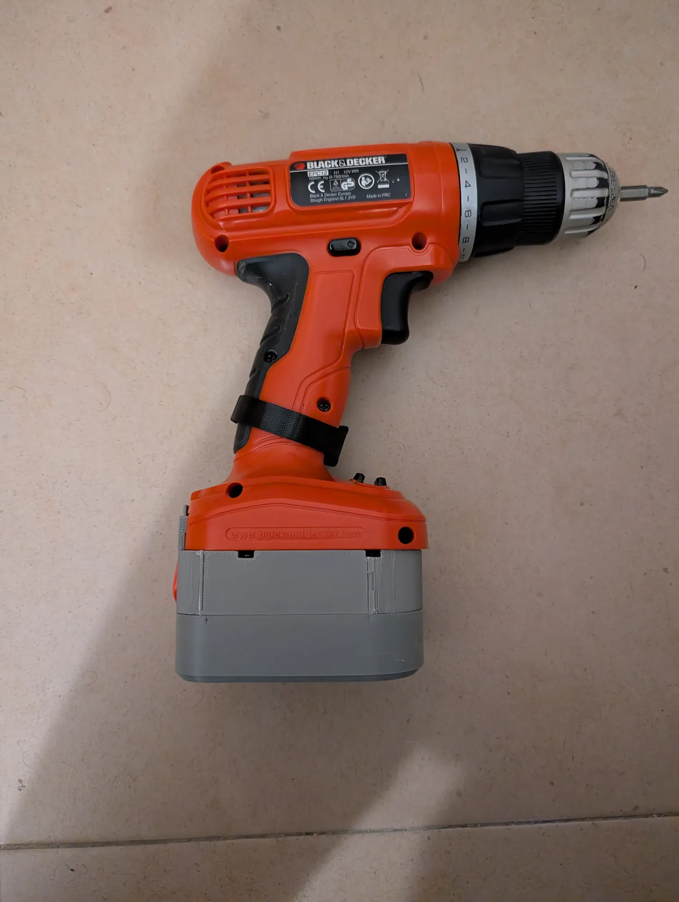
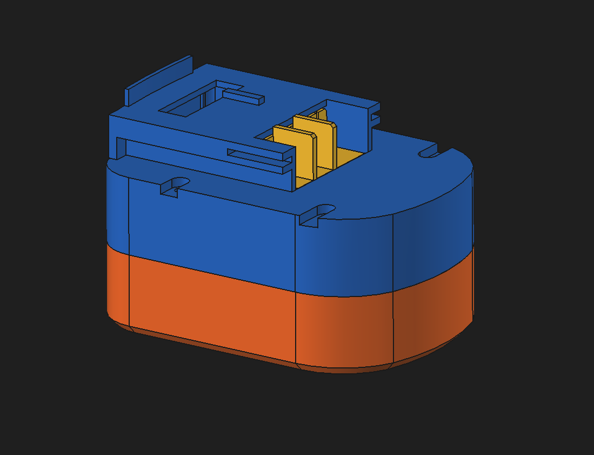

# 3S2P 18650 Drill Battery Conversion

This project replaces the original **NiCd battery pack** of a Black & Decker drill with a custom **3S2P lithium-ion battery pack** built from 18650 cells.

The original NiCd battery was mostly dead and no longer held a charge, so instead of buying a replacement pack I designed a new lithium battery that fits inside the original housing.

The pack uses **six 18650 cells in a 3S2P configuration**, a **40A BMS for protection**, and a **USB-powered 3S charger module** for easy charging.

## Why I Built This

This drill uses **NiCd batteries**, which degrade over time. I wanted to keep using this drill and checked out a replacement battery, but it was quite expensive, so I decided to use some of my spare 18650 cells to build a custom pack instead.

Lithium-ion cells offer several advantages:

- Higher energy density  
- Lower weight  
- No memory effect  
- Better voltage stability under load  

By building a custom pack using **18650 cells**, the drill can continue to be used without purchasing an expensive replacement battery. :yay:

## Images

CAD - click to expand

## Features

- 3S2P lithium-ion battery configuration  
- Six 18650 cells  
- Integrated **40A BMS** for protection  
- USB-C charging
- Compatible with original drill terminals

## Battery Configuration

- **Cell Type**: 18650 lithium-ion  
- **Configuration**: 3S2P  
- **Nominal Voltage**: 11.1V  
- **Fully Charged Voltage**: 12.6V  
- **Capacity**: depends on the cells used

## Electronics

### BMS

A **3S 40A BMS** is used to provide:

- Overcharge protection  
- Overdischarge protection  
- Overcurrent protection  

Module used:

https://es.aliexpress.com/item/1005005676259423.html

### Charger

Charging is handled by a **USB-powered 3S lithium charger module**, which allows the pack to be charged easily from a USB power supply.

Module used:

https://es.aliexpress.com/item/1005005856945497.html

## Safety Notes

Working with lithium-ion cells requires caution.

**Important considerations**:

- Use **matched cells with similar capacity and internal resistance**  
- Ensure proper insulation between cells  
- Never short-circuit lithium cells  
- Use a **BMS rated for the current draw of the tool**  
- **Verify correct polarity before connecting the pack**